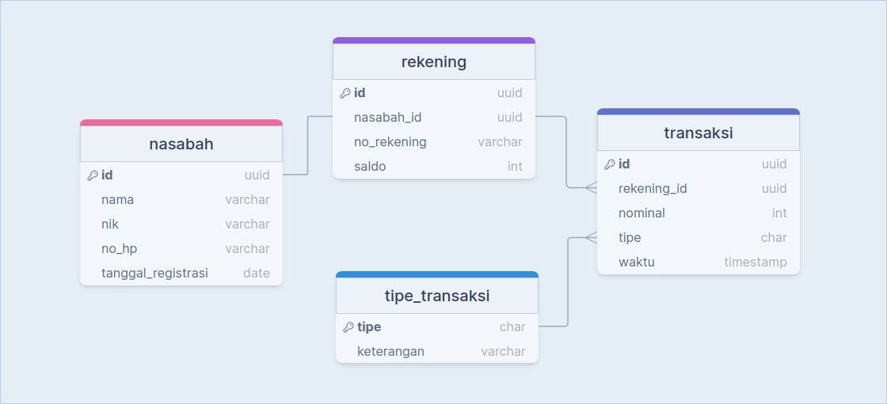
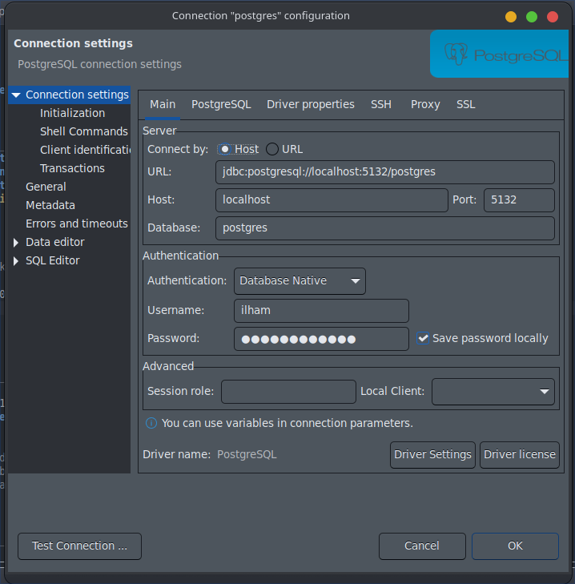

# REST API Bank dengan FastAPI

Repository ini adalah sebuah REST API sistem bank simpel yang dibuat dengan menggunakan FastAPI Python.

## Dependensi
- `os`
- `dotenv`
- `fastapi`
- `uvicorn`
- `psycopg2`

## API Spec
| ROUTE   | HTTP METHOD | REQUEST PAYLOAD | RESPONSE |
|---------|-------------|-----------------|----------|
| /daftar | POST | { "nama": string, "nik": string, "no_hp": string } | { "success": string, "message": string, "data": { "no_rekening": string } } |
| /tabung | POST | { "no_rekening": string, "nominal": integer } | { "success": string, "message": string, "data": { "saldo": integer } } |
| /tarik | POST | { "no_rekening": string, "nominal": integer } | { "success": string, "message": string, "data": { "saldo": integer } } |
| /saldo/{no_rekening} | GET | | { "success": string, "message": string, "data": { "saldo": integer } } |
| /mutasi/{no_rekening} | GET | | { "success": string, "message": string, "data": { "data": array } }

## Rancangan database
desain database menggunakan [drawsql.app](https://drawsql.app/)


## Cara penggunaan
### Setup postgresql di Docker
1. pull postgres image dengan menjalankan command `docker pull postgres`
2. run container dengan menjalankan command `docker run -d -p 5132:5432 --name {NAMA_KONTAINER} -e POSTGRES_USER={USER_DATABASE_ANDA} -e POSTGRES_PASSWORD={PASSWORD_USER_DATABASEB_ANDA} postgres`

### Tambah koneksi di software database
untuk memudahkan dalam memantau data, tambahkan koneksi ke database di software database anda, disini saya menggunakan DBeaver.  


selanjutnya, kita akan membuat database dan tabel-tabel untuk menyimpan data. jalankan `database.sql` yang ada di folder `documentation/database.sql`

### Buat .env file
buat file `.env` yang akan menyimpan environment variabel di root folder project:
```
DATABASE=NAMA_DATABASE
HOST=localhost
USER=USER_DATABASE
PASSWORD=PASSWORD_USER_DATABASE
PORT=PORT_DATABASE
```

### Install dependensi python
`pip install -r requirements.txt`

### Jalankan FastAPI
`uvicorn main:app --reload`

### Test API dengan Postman
import file `postman_collection.json` ke Postman, untuk menguji API.  

psps: perhatikan lagi request body nya ya, sesuaikan dengan no rekening yang sudah ada di database anda.